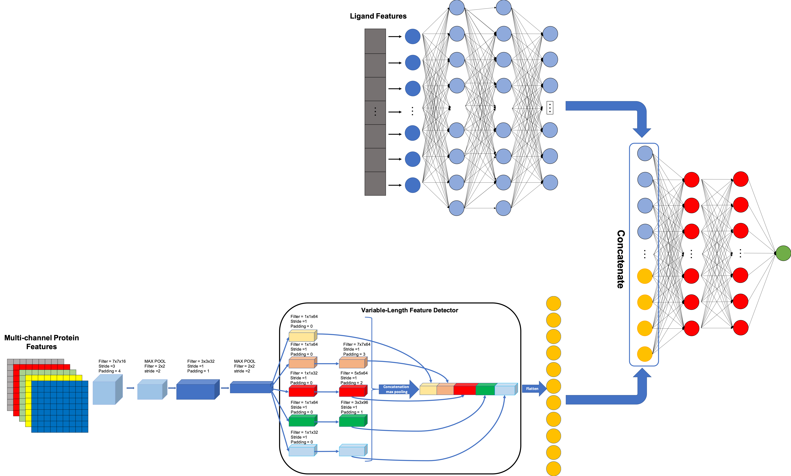
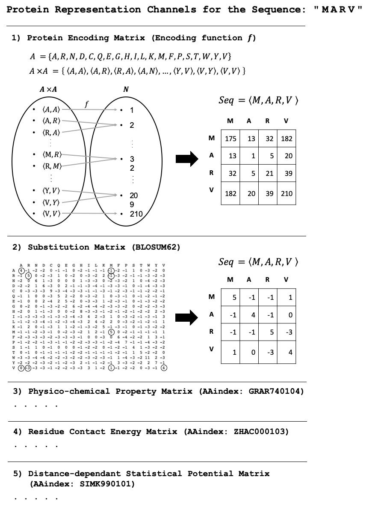

# MDeePred: Multi-Channel Deep Chemogenomic Modeling of Receptor-Ligand Binding Affinity Prediction for Drug Discovery

## Protein Representation

## Descriptions of folders and files in the MBAPred repository

## Development and Dependencies

#### [PyTorch 0.4.1](https://pytorch.org/get-started/previous-versions/)
#### [Pandas 0.23.4](https://pandas.pydata.org/pandas-docs/version/0.23.4/install.html)
#### [Sklearn 0.20](https://scikit-learn.org/0.20/install.html)
#### [Numpy 1.14.5](https://pypi.python.org/pypi/numpy/1.13.3)

## How to run pre-trained ready-to-use MBAPred models to generate DTI predictions

**Output of the script:**

## How to train a model

**Output of the script:**

## How to re-produce performance comparison results for MBAPred and other methods 

## License

    Copyright (C) 2019 CanSyL

This program is free software: you can redistribute it and/or modify it under the terms of the GNU General Public License as published by the Free Software Foundation, either version 3 of the License, or (at your option) any later version.

This program is distributed in the hope that it will be useful, but WITHOUT ANY WARRANTY; without even the implied warranty of MERCHANTABILITY or FITNESS FOR A PARTICULAR PURPOSE. See the GNU General Public License for more details.

You should have received a copy of the GNU General Public License along with this program.  If not, see <http://www.gnu.org/licenses/>.

