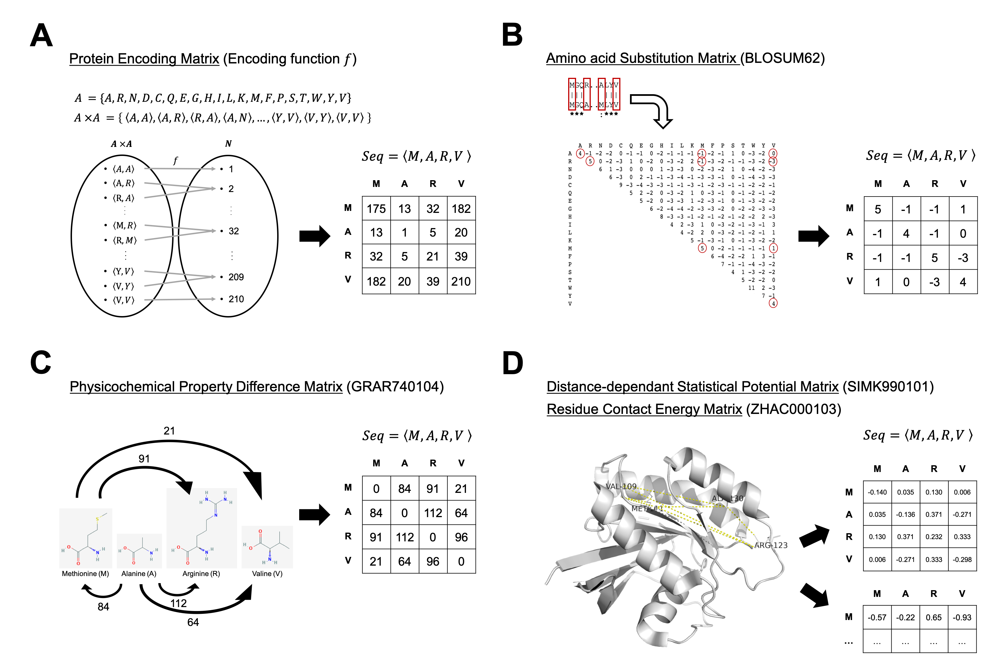

# MDeePred: Multi-Channel Deep Chemogenomic Modeling of Receptor-Ligand Binding Affinity Prediction for Drug Discovery

**Motivation:**
Identification of interactions between bioactive small molecules and target proteins is crucial for novel drug discovery, drug repurposing and uncovering off-target effects. Due to the tremendous size of the chemical space, experimental bioactivity screening efforts require the aid of computational approaches. Although deep learning models have been successful in predicting bioactive compounds, effective and comprehensive featurization of proteins, to be given as input to deep neural networks, remains a challenge.

**Results:**
Here, we present a novel protein featurization approach to be used in deep learning-based compound-target protein binding affinity prediction. In the proposed method, multiple types of protein features such as sequence, structural, evolutionary and physicochemical properties are incorporated within multiple 2-D vectors, which is then fed to state-of-the-art pairwise input hybrid deep neural networks to predict the real-valued compound-target protein interactions. The method adopts the proteochemometric approach, where both the compound and target protein features are employed at the input level to model their interaction. The whole system is called MDeePred and it is a new method to be used for the purposes of computational drug discovery and repositioning. We evaluated MDeePred on well-known benchmark datasets and compared its performance with the state-of-the-art methods. We also performed in vitro comparative analysis of MDeePred predictions with selected kinase inhibitors’ action on cancer cells. MDeePred is a scalable method with sufficiently high predictive performance. The featurization approach proposed here can also be utilized for other protein-related predictive tasks. More information can be obtained from [MDeePred journal article](https://doi.org/10.1093/bioinformatics/btaa858).

## System architecture of MDeePred


## Protein representation approach


## Descriptions of folders and files in the MDeePred repository

* **bin** folder includes the source code of MDeePred.

* **training_files** folder contains various traininig/test datasets mostly formatted for observational purposes and for employment in future studies
    * **Davis** contains training data points, features, data splits for Davis dataset based on Setting-1. **compound_feature_vectors/ecfp4_normalized.tsv** includes ecfp4 features of ligands. **dti_datasets/comp_targ_affinity.csv** is a csv file where each line is formatted as <compound_id>,<target_id>,<bioactivity_value>. **helper_files** includes smiles strings and fasta files of ligands and proteins, respectively. **target_feature_vectors** is for storing target feature vectors which can be downloaded from the following link.
    * **Davis_Filtered** contains training data points, features, data splits for Filtered Davis dataset based on Setting-1. **compound_feature_vectors/ecfp4_normalized.tsv** includes ecfp4 features of ligands. **dti_datasets/comp_targ_affinity.csv** is a csv file where each line is formatted as <compound_id>,<target_id>,<bioactivity_value>. **helper_files** includes smiles strings and fasta files of ligands and proteins, respectively. **target_feature_vectors** is for storing target feature vectors which can be downloaded from the following link.
    * **PDBBind_Refined** contains training data points, features, data splits for PDBBind Refined dataset based on Setting-2. **compound_feature_vectors/ecfp4_normalized.tsv** includes ecfp4 features of ligands. **dti_datasets/comp_targ_affinity.csv** is a csv file where each line is formatted as <compound_id>,<target_id>,<bioactivity_value>. **helper_files** includes smiles strings and fasta files of ligands and proteins, respectively. **target_feature_vectors** is for storing target feature vectors which can be downloaded from the following link.
    * **kinome** contains training data points, features, data splits for Kinase dataset based on Setting-2. **compound_feature_vectors/ecfp4_normalized.tsv** includes ecfp4 features of ligands. **dti_datasets/comp_targ_affinity.csv** is a csv file where each line is formatted as <compound_id>,<target_id>,<bioactivity_value>. **helper_files** includes smiles strings and fasta files of ligands and proteins, respectively. **target_feature_vectors** is for storing target feature vectors which can be downloaded from the following link.

## Development and Dependencies

#### [PyTorch 0.4.1](https://pytorch.org/get-started/previous-versions/)
#### [Pandas 0.23.4](https://pandas.pydata.org/pandas-docs/version/0.23.4/install.html)
#### [Sklearn 0.20](https://scikit-learn.org/0.20/install.html)
#### [Numpy 1.14.5](https://pypi.python.org/pypi/numpy/1.13.3)


## How to re-produce performance comparison results for MDeePred and other methods 
* Clone the Git Repository
* Download the target matrices and copy them under **target_feature_vectors** of the corresponding dataset
    * Download target features for Davis and Filtered Davis [here](https://www.dropbox.com/s/74aaln7nzoqfjww/davis_filtered_davis_target_feature_vectors_LEQ500.tar.gz?dl=0)
    * Download target features for PDBBind Refined [here](https://www.dropbox.com/s/0o90ophu8w6fudr/pdbbind_refined_target_feature_vectors_LEQ500.tar.gz?dl=0)
    * Download target features for Kinome Dataset [here](https://www.dropbox.com/s/r4fl3csm93o2khs/kinome_target_feature_vectors_LEQ1000.tar.gz?dl=0)

* Run the below commands for each dataset

#### Explanation of Parameters
**--chln**: number of neurons in compound hidden layers (default: 1024_1024)

**--tlnaf**: number of neurons after flattening target conv layers (default: 256)

**--lhln**: number of neurons in last two hidden layers before output layer (default: 1024_1024)

**--lr**:learning rate (default: 0.0001)

**--bs**: batch size (default: 32)

**--td**: the name of the training dataset (default: Davis)

**--cf**: compound features separated by underscore character (default: ecfp4)

**--tf**: target features separated by underscore character (default: sequencematrix500_ZHAC000103LEQ500_GRAR740104LEQ500_SIMK990101LEQ500_blosum62LEQ500)

**--setting**: Determines whether to perform  5-fold XV (setting-1) or train-validation-test (setting 2) (default:setting1)

**--dropout**: dropout rate (default: 0.1)

**--epoch**: number of epochs (default: 200)

**--en**: the name of the experiment (default: my_experiment)

#### For Davis Dataset
```
python main_training.py --chln 1024_1024 --tlnaf 256 --lhln 1024_1024 --lr 0.0001 --bs 32 --td Davis --cf ecfp4 --tf sequencematrix500_ZHAC000103LEQ500_GRAR740104LEQ500_SIMK990101LEQ500_blosum62LEQ500 --setting 1 --dropout 0.1 --epoch 200 --en davis_dataset_retraining
```
#### For Filtered Davis Dataset
```
python main_training.py --chln 1024_1024 --tlnaf 128 --lhln 1024_512 --lr 0.0001 --bs 32 --td Davis_Filtered --cf ecfp4 --tf sequencematrix500_ZHAC000103LEQ500_GRAR740104LEQ500_SIMK990101LEQ500_blosum62LEQ500  --setting 1 --dropout 0.1 --epoch 200 --en davis_filtered_dataset_retraining
```

#### For PDBBind Refined Dataset
```
python main_training.py --chln 1024_1024 --tlnaf 128 --lhln 1024_512 --lr 0.0001 --bs 32 --td Davis_Filtered --cf ecfp4 --tf sequencematrix500_ZHAC000103LEQ500_GRAR740104LEQ500_SIMK990101LEQ500_blosum62LEQ500  --setting 2 --dropout 0.25 --epoch 200 --en pdbbind_refined_dataset_retraining
```

#### For Kinome Dataset
```
python main_training.py --chln 1024_1024 --tlnaf 256 --lhln 1024_512 --lr 0.0001 --bs 32 --td Davis_Filtered --cf ecfp4 --tf sequencematrix500_ZHAC000103LEQ500_GRAR740104LEQ500_SIMK990101LEQ500_blosum62LEQ500  --setting 2 --dropout 0.1 --epoch 200 --en kinome_dataset_retraining
```

#### Output of the scripts
**main_training.py** creates a folder under named **experiment_name** (given as argument **--en**) under **result_files** folder. Two files are created under **results_files/<experiment_name>**: **predictions.txt** contains predictions for independent test dataset. The other one is named as **performance_results.txt** which contains the best performance results for each fold (if setting-1 is chosen) or for the test dataset (if setting-2 is chosen). Sample output files for Davis dataset is given under **results_files/davis_dataset_my_experiment**.
#### Pre-trained Models
* PyTorch state dictionary for pretrained kinase model is available in [here](https://www.dropbox.com/s/92bmvglk5p5ln1z/pretrained_kinome_model_state_dict.pth?dl=0).
* PyTorch state dictionary for pretrained GPCR model is available in [here](https://www.dropbox.com/s/7qsez2s5dthi5qk/pretrained_gpcr_model_state_dict.pth?dl=0).

## Article

If you use MDeePred please consider citing:
<br></br>
Rifaioglu, A. S., Cetin Atalay, R., Cansen Kahraman, D., Doğan, T., Martin, M., & Atalay, V. (2020). MDeePred: Novel Multi-Channel protein featurization for deep learning based binding affinity prediction in drug discovery. *Bioinformatics*, btaa858 [doi:10.1093/bioinformatics/btaa858].


## License

    Copyright (C) 2020 CanSyL

This program is free software: you can redistribute it and/or modify it under the terms of the GNU General Public License as published by the Free Software Foundation, either version 3 of the License, or (at your option) any later version.

This program is distributed in the hope that it will be useful, but WITHOUT ANY WARRANTY; without even the implied warranty of MERCHANTABILITY or FITNESS FOR A PARTICULAR PURPOSE. See the GNU General Public License for more details.

You should have received a copy of the GNU General Public License along with this program.  If not, see <http://www.gnu.org/licenses/>.

